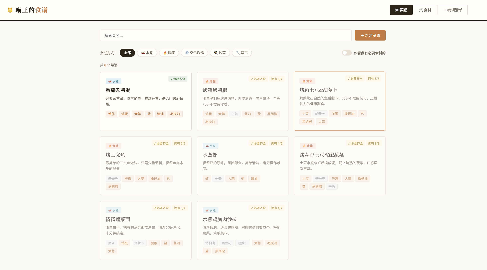

[中文](README.md) | [English](README.en.md)

# Meow King's Recipe App

A lightweight home-cooking app that combines recipes, ingredient inventory, expiry tracking, and AI-powered suggestions in one interface.

Backend: FastAPI + SQLite. Frontend: vanilla HTML/CSS/JS single-page app.



## Current Features

- Recipe management: create, edit, delete, search, filter by cooking method
- Ingredient management: category-based organization, owned status, stock date, expiry date
- Expiry handling: one-click clear for expired owned ingredients
- Multi-house isolation: each house has its own ingredient/category data
- AI recommendation:
 	- Generate cooking suggestions from selected ingredients
 	- Model switcher in UI: `mistral-large-latest` / `mistral-medium-latest` / `mistral-small-latest`
 	- Markdown output rendering in the frontend
 	- Request elapsed-time timer

## Tech Stack

- FastAPI
- SQLite
- Vanilla HTML / CSS / JavaScript
- OpenAI-compatible SDK (currently configured for Mistral API)
- Docker / Docker Compose

## Local Development

Requirement: Python 3.12+

1. Install dependencies

```bash
uv sync
```

1. Configure environment variables (recommended in `server/.env`)

```dotenv
PORT=3001
RECIPE_PASSWORD=your-password

LLM_API_URL=https://api.mistral.ai/v1
LLM_API_KEY=your-api-key
LLM_MODEL=mistral-large-latest
LLM_TIMEOUT_SECONDS=20
```

1. Start server (recommended from `server/` directory)

```bash
cd server
uv run uvicorn main:app --reload --log-level debug
```

1. Open in browser

- If you explicitly set a port in command, use that port
- If you rely on `.env` with `PORT=3001`, open <http://localhost:3001>

## Environment Variables

- `PORT`: server port
- `RECIPE_PASSWORD`: write-operation password (validated via `x-recipe-password` header)
- `DB_PATH`: SQLite path (default: `data/recipes.db`)
- `LLM_API_URL`: OpenAI-compatible API base URL (Mistral example: `https://api.mistral.ai/v1`)
- `LLM_API_KEY`: LLM API key
- `LLM_MODEL`: default model used when request does not provide one
- `LLM_TIMEOUT_SECONDS`: LLM request timeout seconds

## Docker

```bash
docker compose up --build -d
```

Note: current `docker-compose.yml` uses an external network `homelab`. If it does not exist on your machine, create it first or update compose networking.

## Project Structure

```text
.
├── data/                # SQLite files
├── documents/           # Deployment docs and screenshots
├── public/              # Static frontend
├── server/              # FastAPI backend
├── Dockerfile
├── docker-compose.yml
├── pyproject.toml
├── README.md
└── README.en.md
```

## Deployment Docs

- Chinese: [documents/DEPLOYMENT.md](documents/DEPLOYMENT.md)
- English: [documents/DEPLOYMENT.en.md](documents/DEPLOYMENT.en.md)
